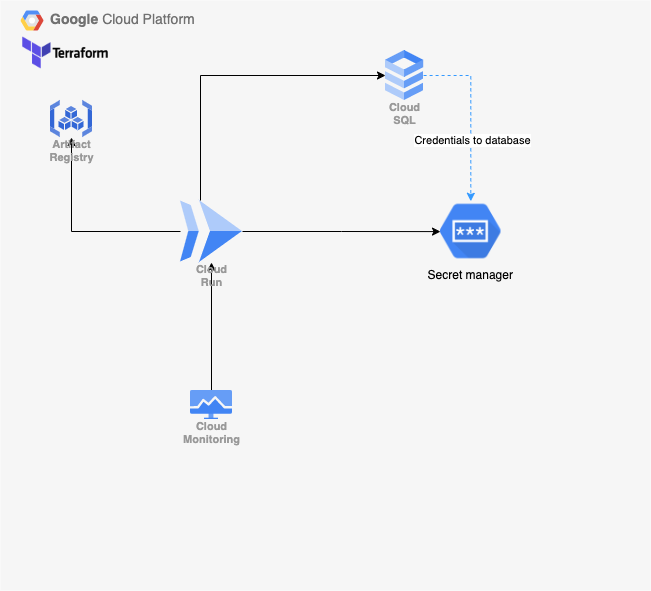

## Google Cloud Platform - Sabre project
### Architecture

The goal of project is to make several GCP services work together. 

The services that will be used in the project are:
* Google Kubernetes Engine  
  Kubernetes Cluster will be used for deploying and maintaining application. It will make use of deployment and secret.
  The application will be simple (probably Go) application posting and retrieving data from database.
* Cloud SQL  
  It will provide SQL database to store data for application use.
* Google Secret Manager  
  Secret manager will create secret with database credentials.
* Cloud Logging and Cloud Monitoring  
  Provides insight into the application's health.